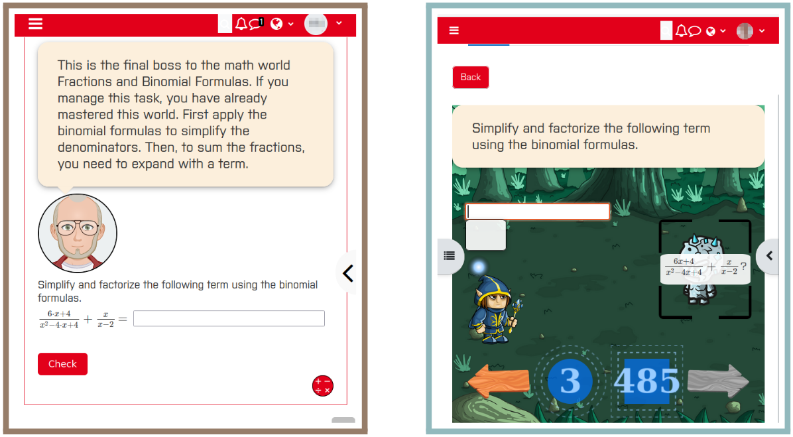
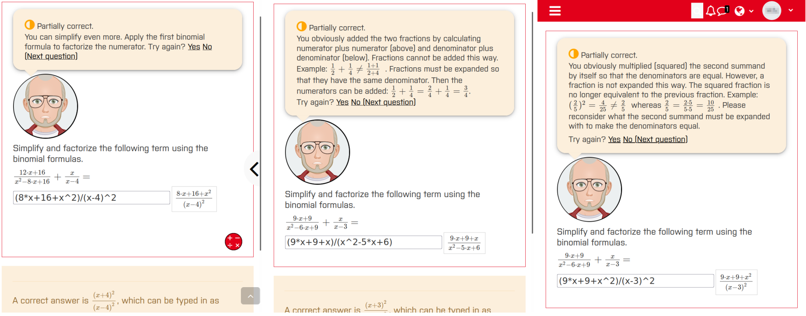
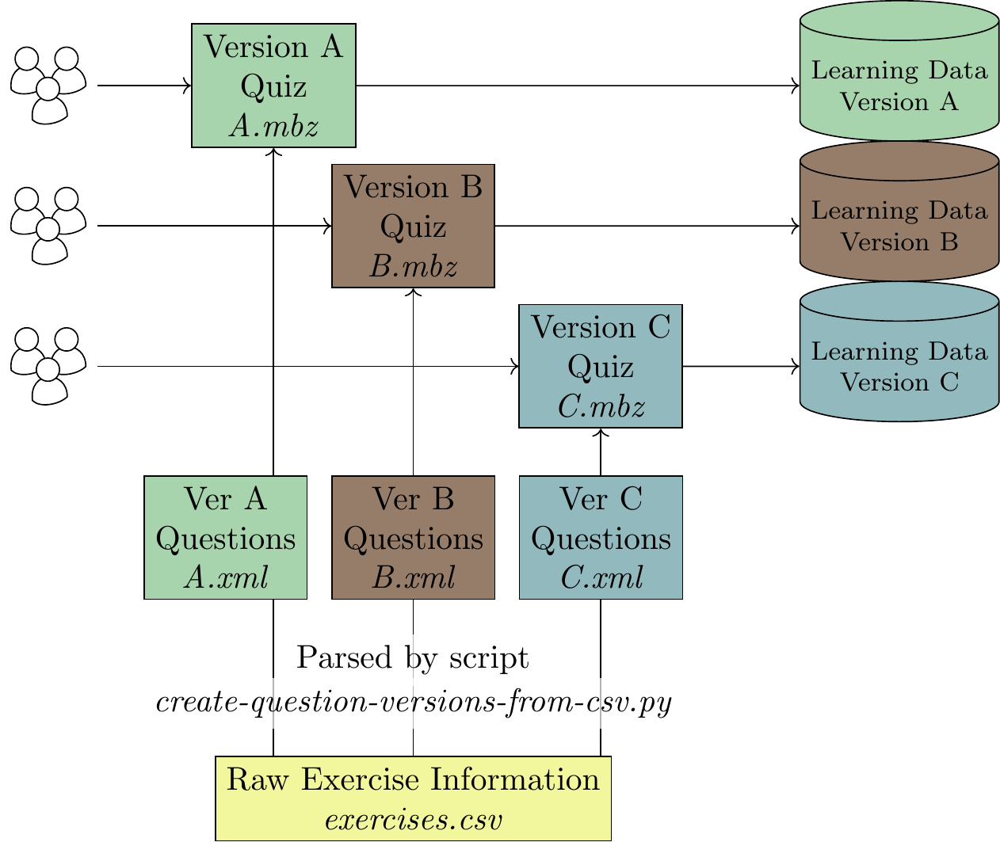
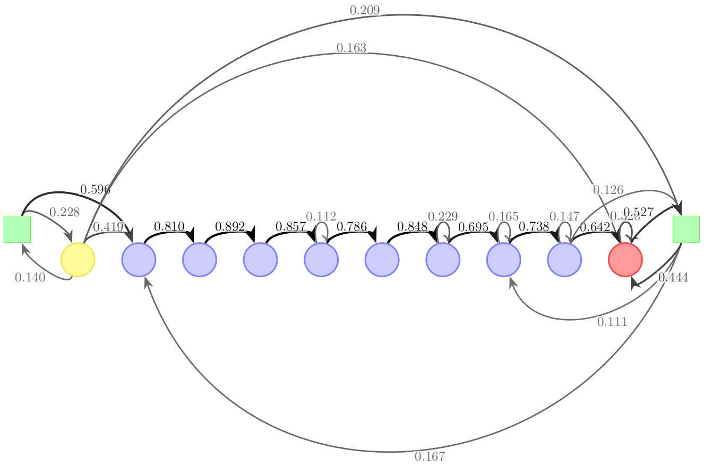

# Math Digital Mentoring

This repository offers material to enrich mathematical exercises in the Learning Management Systems (LMS) Moodle and ILIAS with interactive elements, e.g., gamification or adaptive learning, and the necessary materials to analyze their effects. This lightweight solution can be implemented by lecturers in their courses using the on-board tools of the learning management system. No installation of an additional plugin is needed.

To the [website](https://malteneugebauer.github.io/math-digital-mentoring/).

There are several ways to get started.
- Take a look on some working examples in the [Live Demos Section](#live-demos).
- Load a stable version of the material in your LMS and adapt it to your needs: [LMS-readable Packages Section](#lms-readable-packages).
- Copy and paste the code directly in questions of your LMS: Check the [Insertable Code Section](#insertable-code).
- Once applied at your university, the resulted effects of the tested versions can be measured with analytics tools offered in the [Effect Measurement Section](#effect-measurement). Here you find a lightweight dashboard tool that can also be implemented without installation. For deeper analysis, also Python code is provided here.
- Check the [Paper Section](#papers) for findings from research related to this approach.

Apart form that, the repository also contains [Screenshots](#screenhots) and information about [Troubleshooting](#troubleshooting), [Exercise Generation](#exercise-generation) and the [License](#license) (MIT).

[//]: # (<REPLACE < with open and > with closed paranthesis>For ILIAS some special features have to be considered, which are detailed in the [ILIAS Section]<#ilias>.)

## Screenshots from LMS

Examples of the same exercise in the pedagogical agent design (left) and in the fantasy game design (right).

Example of three different feedbacks offered by the STACK plugin in the pedagogical agent design.

## Live Demos
[Moodle course with all demos](https://hsbo-clone.ebwl-oer.de/course/view.php?id=14)

The demos run in an open Moodle system of Bochum UAS. You are logged in automatically after a short period of time. Then the learning material can be started by clicking the "Attempt quiz" button.

- The version [Pedagogical Agent (Adaptive)](https://hsbo-clone.ebwl-oer.de/mod/quiz/view.php?id=145) is characterized by learners being directed to different questions depending on whether or not they correctly solve the "boss" tasks.
- The version [Pedagogical Agent (Instant Tutoring)](https://hsbo-clone.ebwl-oer.de/mod/quiz/view.php?id=1699) is characterized by immediate feedback that is provided to the learners while they are still solving the exercise.
- The [Fantasy Game](https://hsbo-clone.ebwl-oer.de/mod/quiz/view.php?id=1700) version ties the tasks into a medieval story and adapts the learning environment accordingly.
- The [Plain](https://hsbo-clone.ebwl-oer.de/mod/quiz/view.php?id=1698) version shows how the questions appear by default and serves as a control design for research projects with an experimental approach.

## LMS-readable Packages

You can either import all versions or some selected versions with the help of the LMS' "restore" option. In this case, the [Moodle Backup files](#moodle-backup-files-mbz) are needed.

Or you can import the questions in the question bank of your course and create the learning material from that. In this case you can make use of the [question files](#question-files-xml). You should choose this option when you work with ILIAS.

Or you can parse the exercises for any of the versions from an editable table file. In this case, please refer to the [Exercise Generation Section](#exercise-generation).

If you want to apply this frontend-oriented approach to other questions than the here presented, check the [Insertable Code Section](#insertable-code).

To get an overview of the differenct versions, please refer to the [Live Demos](#live-demos) and [Screenshots](#screenhots) sections.

[//]: # (Which ever way you choose, please consider the respective requirements and the step by step guides.)

### Moodle Backup Files (mbz)

#### Step by Step Guide

1. Download one of the `*.mbz`-files (according to your preferred version and language) of this repository.
1. Create a new course in your Moodle system or navigate to an existing one where you want to embed the activities.
1. Navigate to the course administration and pick the restore option.
1. Pick the downloaded `*.mbz`-file in the "Upload File" dialogue.
1. Perform the restore in your Moodle course. Watch out to pick the right option to not delete any existing content of your course during the restore accidentally.

#### Files
| Version | File (german) | File (english)  | Tested with     |
|---------|-------------- |-----------------|-----------------|
| Normal  | [backup-quiz-normal_ger.mbz](backup-files/backup-quiz-normal_ger.mbz) | [backup-quiz-normal_en.mbz](backup-files/backup-quiz-normal_en.mbz)| Moodle 4.1-4.4      |
| Pedagogical Agent (Adaptive)      | [backup-quiz-normal_ger.mbz](backup-files/backup-pa-simple_ger.mbz) | [backup-quiz-normal_en.mbz](backup-files/backup-pa-simple_en.mbz)  | Moodle 4.1-4.4      |
| Pedagogical Agent (Instant Tutoring) | [backup-quiz-instant-tutoring_ger.mbz](backup-files/backup-pa-instant-tutoring_ger.mbz) | [backup-quiz-instant-tutoring_en.mbz](backup-files/backup-pa-instant-tutoring_en.mbz)  | Moodle 4.1-4.4      |
| Fantasy Game      | [backup-fantasy_ger.mbz](backup-files/backup-fantasy_ger.mbz) | [backup-fantasy_en.mbz](backup-files/backup-fantasy_en.mbz)  |    Moodle 4.1-4.4      | 
| All Versions | [backup-complete-course_ger.mbz](backup-files/backup-complete-course_ger.mbz) | [backup-complete-course_en.mbz](backup-files/backup-complete-course_en.mbz)  |   Moodle 4.1-4.4      |

### Question Files (xml)

#### Step by Step Guide
[//]: # (![]<video/moodle-how-to-import-questions-and-create-a-quiz-from-them.webm>)

1. Download one of the `*.xml`-files (according to your preferred version and language) of this repository.
1. Create a new course in your Moodle system or navigate to an existing one where you want to embed the activities.
1. Navigate to the course's question bank.
1. Navigate to the question bank's import page.
1. Pick the downloaded `*.xml`-file in the "Upload File" dialogue.
1. Perform the import.

It is preferred to create a quiz from these questions in the following way.
1. In your course's main page turn editing on.
1. Create a quiz element at an arbitrary position of your course.
1. Navigate to the "Add questions" page of the newly created quiz.
1. Choose "Add from question bank".
1. Choose the category of the selected version (see table).
1. Go for sure that the option "Also show elements from subcategories" is checked.
1. Sort the questions alphabetically in ascending order.
1. Click on "Show all ... questions".
1. Select all questions that are currently shown.
1. Click on "Add."
1. You may now want to preview the quiz to see if the questions are properly included.

#### Files
| Version | File (german) | File (english)  | Question Category | Tested with     |
|---------|-------------- |-----------------|-------------|----|
| Normal  | [questions-normal_ger.xml](question-files/questions-normal_ger.xml) | [questions-normal_en.xml](question-files/questions-normal_en.xml) |  |  Moodle 4.1-4.4      |
| Pedagogical Agent (Adaptive)      | N.A. | N.A.| Adaptive Learning Test|  Moodle 4.1-4.4      |
| Pedagogical Agent (Instant Tutoring) | [questions-pa-its_ger.xml](question-files/questions-pa-its_ger.xml) | [questions-pa-its_en.xml](question-files/questions-pa-its_en.xml)| instant-tutoring |  Moodle 4.1-4.4      |
| Fantasy Game      | [questions-rpg_ger.xml](question-files/questions-rpg_ger.xml) | [questions-rpg_en.xml](question-files/questions-rpg_en.xml)|  rpg  |  Moodle 4.1-4.4      |
 

## Insertable Code

Instead of using a given set of questions as in the [LMS-readable Packages Section](#lms-readable-packages) the code can also be applied to other questions. Currently, only questions of the type STACK are supported. If you want to apply one of the designs to other question types (e.g., multiple-choice, fill-the-gap, ...) please contact the [repository owner](mailto:malte.neugebauer@hs-bochum.de) for support.

It is important to consider that each design carries additional information that are either saved in the script or in an additional configuration element that is included in the LMS by importing the exercise files. These information are e.g., how exercises relate to each other in the "Pedagogical Agent (Adaptive)" design or the colors of the fairies in the "Fantasy Game" design.

When applying the code directly to other exercises, these information have to be included and adapted to ensure compatibility. Thus, it is preferred to generate the exercises from a table as described in the [Exercise Generation Section](#exercise-generation). By doing so the configuration elements are automatically parsed.

[//]: # (To achieve this, download the file of your preferred version and language and follow the steps below.)

[//]: # (### Files)

| Version | File (german) | File (english)  | Tested with     |
|---------|-------------- |-----------------|----|
| Normal  | No JavaScript included | No JavaScript included |  Moodle 4.1-4.4      |
| Pedagogical Agent (Adaptive)      | [alquiz.js](script/alquiz.js) | [alquiz_en.js](script/alquiz_en.js) |  Moodle 4.1-4.4      |
| Pedagogical Agent (Instant Tutoring) | [alquiz-qpool-instant-tutoring.js](script/alquiz-qpool-instant-tutoring.js) | [alquiz-qpool-instant-tutoring-en.js](script/alquiz-qpool-instant-tutoring.js)|  Moodle 4.1-4.4      |
| Fantasy Game      | [alquiz-fantasy-bg-ver3.js](script/alquiz-fantasy-bg-ver3.js) | [alquiz-fantasy-bg-ver3-en.js](script/alquiz-fantasy-bg-ver3.js)|  Moodle 4.1-4.4      |

[//]: # (<REPLACE < with open and > with closed paranthesis and REPLACE -- with line break>### Step by Step Guide----1. In your LMS navigate to a question of your choice.--1. In the input field for changing the question text of this question, switch to the code level.--1. In the first line of the code level question text, insert the following line: `` and paste the beforehand copied text between ``.--1. Create a test with the created exercise.)

## Exercise Generation

The question files for the different versions are automatically parsed with the script [create_question_versions_from_csv.py](exercise-generation/create_question_versions_from_csv.py) with the information from the table [exercises.csv](exercise-generation/exercises.csv). Thus, for changes in the exercise content only one file has to be modified. The modifications will affect the question file of each version.

## Effect Measurement
[//]: # (There are various ways to address the effects of this approach on learners. We propose an experimental setting and test at least two versions: One serves as a control condition and at least one other serves as the treatment condition.)

[//]: # (<REPLACE < with open and > with closed paranthesis>The LMS offers various learning data to lecturers <e. g. grade statistics> by default that may address the question, what effect this approach has on learners. We propose to focus on learners' usage patterns among different designs. The following excerpt from the file [overview.pdf]<> visualizes the data from the datasets [alquiz-analysis-control.csv]<>, [alquiz-analysis-test_its.csv]<>  and [alquiz-analysis-test_rpg.csv]<> from the folders [university1]<./analysis/university_1> and [university2]<./analysis/university_1>. The latter files include each movement of several users within the three different designs <normal, pedagogical agent <instant tutoring> and fantasy game>. These files can be generated by lecturers by running the scripts [alquiz-analyisis-control.js]<> or [alquiz-analyisis-test.js]<> respectively for either the control design or the pa/fantasy designs in the LMS attempt overview page. The Python script [visualize_patterns.py]<> generates several Latex files from that, that are included in the [overview.tex]<> file. For further information about the measurement of effects with this approach please refer to the [Papers Section]<#papers>)
Choose the [Lightweight Dashboard Tool](#lightweight-dashboard-tool) for a first overview of your learners' data. For a deeper analysis you may want to check the [Python code](#python-code) section.
## Lightweight Dashboard Tool
1. Open the file [lightweight_la.js](./analysis/lightweight_la.js) with a text editor. Select all the code and copy. Open the browser of your choice and navigate to the developer console. This can be done in different browsers as follow:

 - For Google Chrome, open the Chrome Menu in the upper-right-hand corner of the browser window and select More Tools > Developer Tools. You can also use Option + ⌘ + J (on macOS), or Shift + CTRL + J (on Windows/Linux).

 - For Firefox, click on the Firefox Menu in the upper-right-hand corner of the browser and selects More Tools > Browser Console. You can also use the shortcut Shift + ⌘ + J (on macOS) or Shift + CTRL + J (on Windows/Linux).
 
 - For Microsoft Edge, open the Edge Menu in the upper-right-hand corner of the browser window and select More Tools > Developer Tools. You can also press CTRL + Shift + i to open it.
 
 - For other browsers, kindly check out their documentation.

2. Click on the console's input and paste the code you copied in the previos step.

3. Run the code. This can usually be done by pressing Enter.

4. An icon should appear on the screen. Click on it to open the dashboard tool. Choose your analysis method and follow the instructions in the dashboard.

## Python Code
The LMS offers various learning data to lecturers (e. g. grade statistics) by default that may address the question, what effect this approach has on learners. To get a deeper understanding learners' usage patterns can additionally visualized as shown in the screenshot by following the steps below. The following excerpt from the file [overview.pdf](./analysis/tex/overview.pdf) visualizes the data from the exemplary dataset [hops.csv](./analysis/hops.csv).

1. In your LMS, navigate to the attempt overview page of one of the quizzes. You should see here a list of attempts users made with the learning material.
1. Go for sure that all attempts are listed here and not only a selection (not: page 1 of ...). In Moodle you can achieve this by adjusting the page size to a large number, e.g., 999.
1. Download either the script [alquiz-analysis-control.js](./analysis/alquiz-analysis-control.js) for the versions "Normal" and "Pedagogical Agent (Adaptive)" or the script [alquiz-analysis-test.js](./analysis/alquiz-analysis-test.js) for the versions with instant feedback, i.e., "Fantasy Game" and "Pedagogical Agent (Instant Tutoring)."
1. The downloaded script files can be opened with any text editor. Copy the script's content and paste it in the console of your browser on the attempt overview page.
1. Run the command `loadUsers();` in the console.
1. The script loads the usage data, as if you would click on the attempts one by one. Check the current download state by running the command `getFetchState();` in the console.
1. When the output of `getFetchState();` doesn't change, you can run `loadAndDownloadCSV();` in the console to download the data as a `*.csv` file. The script anonymizes the downloaded data by default. If you want to take a look on the data file, consider the appropriate options: `;` as cell delimiter, `'` as string delimiter.
1. Give the file a descriptive name, e.g., `usage-data-version-A.csv` and store it on your device.
1. Download the python script [visualize_hops.py](./analysis/visualize_hops.py) and store it in the same folder as the usage data file.
1. Open the python script in a text editor. Find the line of code in the python script that is responsible for the name of the included data file and change it according to the previously saved usage data file.
1. Run the python script. Several Latex files will be generated in a folder named `tex`, located in the same folder as the just executed python script file.
1. Download the file [overview.tex](./analysis/tex/overview.tex) and place it in the just generated `tex` folder.
1. Parse a pdf from the file [overview.tex](./analysis/tex/overview.tex). The resulting file [overview.pdf](./analysis/tex/overview.pdf) contains the usage pattern visualizations.

[//]: # (<REPLACE < with open and > with closed paranthesis>The latter can be generated by running the scripts [alquiz-analysis-control.js]<./analysis/alquiz-analysis-control.js> or [alquiz-analysis-test.js]<./analysis/alquiz-analysis-test.js> for the control design or the pedagogical agent/fantasy game design respectively. The generated file can then by read by the script [visualize-patterns.py]<./analysis/visualize_patterns.py>, which generates several Latex files that are included by the file [overview.tex]<./analysis/tex/overview.tex>.)

## Troubleshooting

Since the approach is based on Javascript, the regulations for using JavaScript inside the LMS are of high importance for the functionality of the approach.

If for any reasons JavaScript is not allowed in question texts of your LMS, the training area exists in your LMS, but will behave like any other test element in the LMS. As an example for the "Pedagogical Agent" version, the math worlds cluster and the endboss symbols in the navigation bar (see screenshots above) won't appear.

In this case, you may want to ask your LMS administrator to allow the usage of JavaScript in question texts for your specific use case.

If you chose to implement the code directly as described in the [Insertable Code Section](#insertable-code) please ensure that the according configuration information for your preferred version align with the question setting as described there. It may be more desired to choose either one of the pre-generated [LMS-readable packages](#lms-readable-packages) or to [generate the exercises](#exercise-generation) from a table. These latter procedures exclude the configuration setting as the cause of the error.

[//]: # (### Training area looks messy or does not work properly)
[//]: # (<REPLACE < with open and > with closed paranthesis and REPLACE -- with line break>The script-file `alquiz.js` adds additional CSS-styling information to the loaded page. These stylings are optimized for the Moodle-system of Hochschule Bochum. It may not fit to the stylings of your Moodle-system. This may cause troubles for up to two cases:--1. If this only relates to the desgin of the training area, you have to identify the two lines, where `alquiz.js` adds the styling information to the page and adapt them to your Moodle-system. To do so, search for `document.createElement<"style">;` and edit the related variable declaration `.innerHTML = "..."`.--1. If this also applies to the functionality of the training area <e. g. the question feedback is not shown in the speech bubble above the question, but below the question>, you have to adapt any `querySelector`, `querySelectorAll` and `getElementById` function in `alquiz.js` to operate correctly with your Moodle-system.)

[//]: # (## ILIAS)
[//]: # (Since the approach is based on Javascript, the regulations for using JavaScript inside the LMS are of high importance for the functionality of the approach.)

## Papers
 - Neugebauer, M.; Erlebach, R.; Kaufmann, C.; Mohr, J.; Frochte, J. (2024): *Efficient Learning Processes By Design: Analysis of Usage Patterns in Differently Designed Digital Self-Learning Environments.* Proceedings of the 16th International Conference on Computer Supported Education. https://doi.org/10.5220/0012558200003693
 - Neugebauer, M. (2024): *Lightweight Learning Analytics Dashboard for Analyzing the Impact of Feedback & Design on Learning in Mathematical E-Learning.* Proceedings 18. Workshop Mathematik in ingenieurwissenschaftlichen Studiengängen. [Preprint](./preprints/Lightweight%20Learning%20Analytics%20Dashboard%20for%20Mathematics.pdf)
 - Neugebauer, M., Tousside, B., Frochte, J. (2023). *Success Factors for Mathematical E-Learning Exercises Focusing First-Year Students.* In: Proceedings of the 15th International Conference on Computer Supported Education (CSEDU). https://doi.org/10.5220/0011858400003470
  - Neugebauer, M, Frochte, J. (2023). *Steigerung von Lernerfolg und Motivation durch gamifizierte Mathematik-Aufgaben in Lernmanagementsystemen.* In: 21. Fachtagung Bildungstechnologien (DELFI). https://doi.org/10.18420/delfi2023-39

## License
See the [LICENSE](./LICENSE)-file for license rights and limitations (MIT).